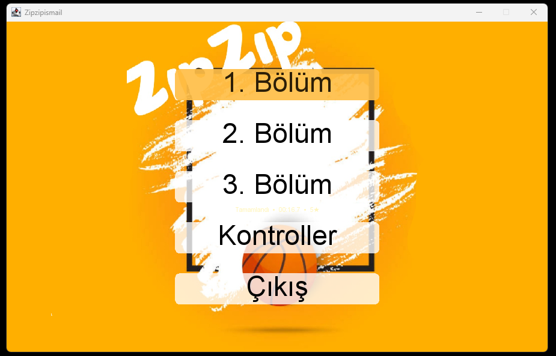
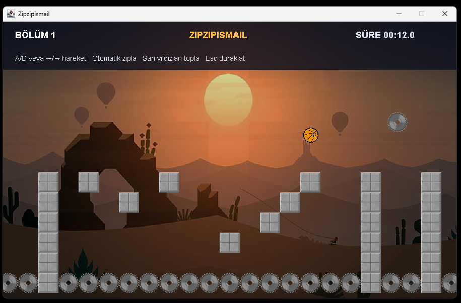
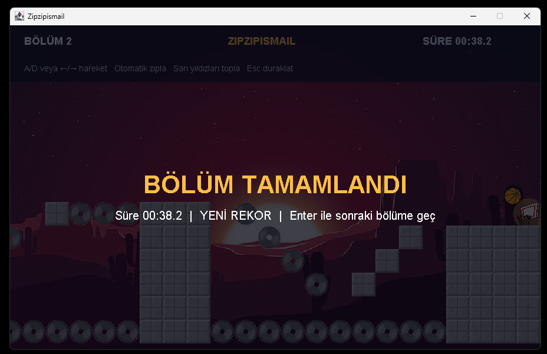
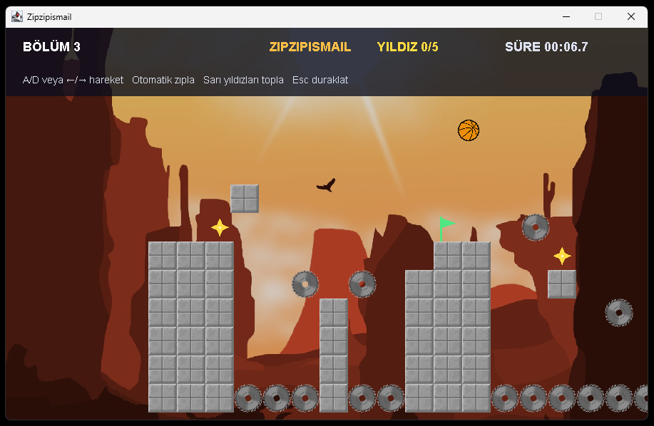
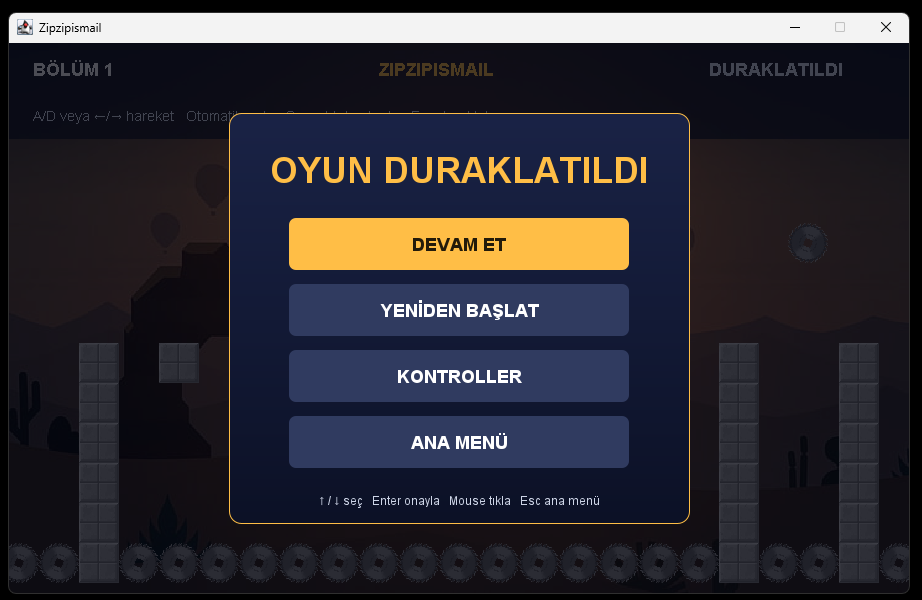
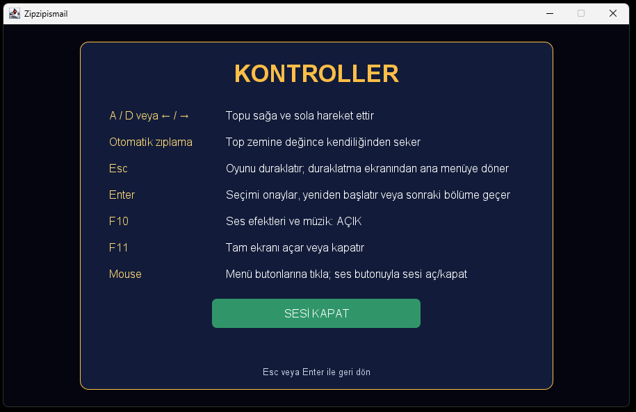
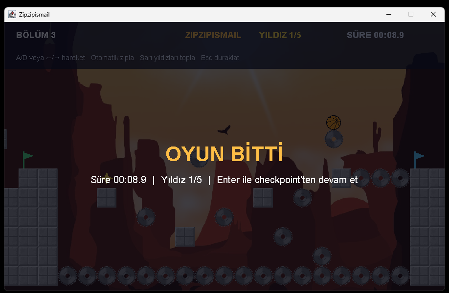

# Zipzipismail

Java Swing ile geliştirilmiş, otomatik zıplayan top mekaniğine sahip 2D platform oyunudur. Oyuncu topu sağa ve sola yönlendirerek testerelerden kaçınır, potaya ulaşır ve özellikle 3. bölümde yıldızları toplamaya çalışır.

Bu proje, Kütahya Dumlupınar Üniversitesi Bilgisayar Mühendisliği bölümünde 1. sınıf uygulama ödevi olarak hazırlanmış bir Java 2D platform oyunudur. Proje daha sonra kaynak kodu, arayüzü, testleri ve Windows paketleme süreci geliştirilerek güncellenmiştir.

## Özellikler

- Otomatik zıplama ve yatay oyuncu kontrolü
- Yuvarlak çarpışma alanına sahip dönen testereler
- Pota ile bölüm tamamlama ve tehlikelerle oyun bitişi
- Duraklatma, devam etme, yeniden başlatma ve ana menü akışı
- Ana menü ve pause ekranında mouse ile seçim
- Oyun içi kontroller yardım ekranı
- Kontroller ekranından ses açma/kapatma
- F10 ile ses, F11 ile tam ekran kısayolu
- Bölüm süresi, yıldız sayısı ve sonuç ekranı
- En iyi süre, tamamlanma ve yıldız bilgilerinin kalıcı kaydı
- 3. bölümde checkpoint, yıldız ve daha yüksek zıplatan özel bloklar
- Kamera takip yumuşatması, toz partikülleri ve squash/stretch top animasyonu

## Ekran görüntüleri

<div align="center">

<table>
  <tr>
    <td></td>
    <td></td>
  </tr>
  <tr>
    <td align="center">Bölüm seçimi</td>
    <td align="center">1. bölüm oynanışı</td>
  </tr>
  <tr>
    <td></td>
    <td></td>
  </tr>
  <tr>
    <td align="center">2. bölüm tamamlandı</td>
    <td align="center">3. bölüm oynanışı</td>
  </tr>
  <tr>
    <td></td>
    <td></td>
  </tr>
  <tr>
    <td align="center">Duraklatma menüsü</td>
    <td align="center">Kontroller ve ses ayarı</td>
  </tr>
</table>

<p></p>
<p>Oyun bitişi ve checkpoint</p>

</div>

## Oynanış demosu

<div align="center">
  
</div>

## Gereksinimler

- JDK 17 veya üzeri
- Maven 3.9 veya üzeri
- Java destekleyen bir masaüstü işletim sistemi

Oyunda harici bir runtime oyun kütüphanesi kullanılmaz; grafik, pencere ve ses için Java SE API’leri kullanılır. Windows üzerinde Maven ile derleme ve JAR çalıştırma doğrulanmıştır.

## Kurulum ve çalıştırma

```powershell
git clone https://github.com/emirkvrak/Zipzipismail.git
cd Zipzipismail
mvn clean package
java -jar target/zipzipismail-1.0.0.jar
```

Kaynak dosyalarını IDE olmadan da Maven ile derleyebilirsiniz. Görsel, harita ve ses dosyaları classpath üzerinden yüklendiği için oyun proje kökünden çalıştırılmak zorunda değildir.

## Kontroller ve kullanıcı arayüzü

| Girdi | İşlev |
|---|---|
| `A / D` veya `← / →` | Topu sağa ve sola hareket ettirir |
| Otomatik zıplama | Top zemine değdiğinde kendiliğinden seker |
| `Esc` | Oyunu duraklatır; duraklatma ekranından ana menüye dönülür |
| `Enter` | Menü seçimini, yeniden başlatmayı veya sonraki bölümü onaylar |
| `F10` | Sesi açar/kapatır |
| `F11` | Tam ekranı açar/kapatır |
| Mouse | Menü ve pause butonlarını seçer |

Ses açma/kapatma butonu `Kontroller` ekranının içindedir. Bu ekrana ana menüden veya oyun içi duraklatma menüsünden ulaşabilirsiniz.

## Oyun akışı

Top otomatik olarak zıplar. Oyuncu yalnızca yatay hareketi yönetir. Testerelere temas etmek oyunu bitirir; potaya ulaşmak bölümü tamamlar. `Enter` ile sonuç ekranından yeniden başlayabilir veya 1. ve 2. bölümlerde sonraki bölüme geçebilirsiniz.

3. bölüm oyunun en zor bölümüdür ve ek olarak checkpoint, yıldız ve daha yüksek zıplama sağlayan `BOUNCY` blokları içerir. Checkpoint etkinleştirildikten sonra oyun bitişinde `Enter` ile checkpoint noktasından devam edilebilir.

## Mimari

Proje, oyun modeli, fizik, state yönetimi, kaynaklar ve çizim sorumluluklarını ayıran sade bir katmanlı yapı kullanır. Katı bir MVC framework'ü değildir; her sınıfın görev alanı küçük ve doğrudan tutulmuştur.

- `app`: Uygulama başlangıcı ve pencere yaşam döngüsü
- `core`: Oyun döngüsü, sabitler ve kullanıcı girdisi
- `entity`: Oyuncu modeli ve oyuncu durumu
- `physics`: Çarpışma yardımcıları
- `world`: Harita, tile, kamera, checkpoint, yıldız ve hareketli platformlar
- `state`: Menü, bölüm, pause akışı ve bölüm ilerlemesi
- `ui`: HUD, menü, kontroller, oyuncu ve dünya çizimleri
- `effect`: Zıplama partikülleri
- `resource`: Görsel, ses, harita kaynağı ve kalıcı ilerleme yönetimi

Önemli yapılar:

- `GameState` ve `AbstractGameState`: Menü ve bölüm state ortaklığı
- `GameStateManager`: State geçişleri ve global ses ayarı
- `Player` ve `CollisionService`: Oyuncu fiziği ve çarpışma kuralları
- `LevelProgress`: Süre, yıldız ve bölüm rekoru sorumluluğu
- `MapLoader` ve `GameMap`: Harita kaynağının yüklenmesi ve oyun dünyası
- `UiTheme`: Ortak arayüz font ve renkleri
- `ProgressStore`: Java Preferences API ile yerel ilerleme kaydı

## Proje yapısı

```text
Zipzipismail/
├── assets/               README ekran görüntüleri ve oynanış demosu
├── src/
│   ├── main/
│   │   ├── java/
│   │   └── resources/
│   └── test/
│       └── java/
├── pom.xml
├── package.ps1
├── .gitignore
├── .gitattributes
└── README.md
```

## Test

JUnit 5 testleri fizik, oyuncu çarpışması, kamera, harita yükleme, checkpoint, yıldız, input, ilerleme, UI render ve state geçişlerini kapsar.

```powershell
mvn test
```

Son doğrulamada **19 test başarılı** olmuştur.

## Paketleme

### Geliştirici JAR'ı

Çalıştırılabilir JAR oluşturmak için:

```powershell
mvn clean package
```

Çıktı:

```text
target/zipzipismail-1.0.0.jar
```

JAR dosyasını doğrudan çalıştıracak bilgisayarda Java 17 veya üzeri bulunmalıdır. Java gerektirmeyen Windows paketi aşağıdaki `package.ps1` betiğiyle oluşturulabilir.

### Java kurmadan Windows'ta oynama

`jpackage` ile Java runtime içeren Windows uygulama görüntüsü oluşturulabilir. Bunun için JDK 17 veya üzeri, Maven 3.9 veya üzeri ve `JAVA_HOME` tanımlı olmalıdır:

```powershell
.\package.ps1
```

Oluşan çıktılar:

```text
dist/Zipzipismail/Zipzipismail.exe
dist/Zipzipismail-portable.zip
```

Portable ZIP başka bir Windows bilgisayara çıkarılıp `Zipzipismail.exe` çalıştırılarak açılabilir; hedef bilgisayarda ayrıca Java kurulması gerekmez. `dist/` ve `target/` derleme çıktıları repository'ye eklenmez.

### Hazır Windows paketini indirme

Java veya Maven kurmadan oynamak için [GitHub Releases sayfasındaki en güncel sürümü](https://github.com/emirkvrak/Zipzipismail/releases/latest) açın ve `Zipzipismail-portable.zip` dosyasını indirin.

1. ZIP dosyasını Windows üzerinde bir klasöre çıkarın.
2. Çıkarılan `Zipzipismail` klasöründeki `Zipzipismail.exe` dosyasını çalıştırın.
3. Portable paket Java runtime içerdiği için hedef bilgisayara ayrıca Java kurulması gerekmez.

## Sınırlamalar

- Tek oyunculu masaüstü oyunudur.
- Online skor tablosu, multiplayer ve veritabanı yoktur.
- Harici oyun motoru kullanılmaz.
- Repository içinde ayrıca açık kaynak lisansı belirtilmemiştir.
- Windows portable paketinin güncel sürümü GitHub Releases üzerinden dağıtılır.

## Proje durumu

Mevcut sürüm oynanabilir Maven/JAR yapısına, Java gerektirmeyen Windows portable EXE paketine, 3 bölüme, pause ve kontrol ekranlarına, kalıcı ilerleme kaydına ve otomatik test kapsamına sahiptir. Yeni bölüm veya yeni oynanış mekaniği eklemek bu README kapsamının dışındadır.
